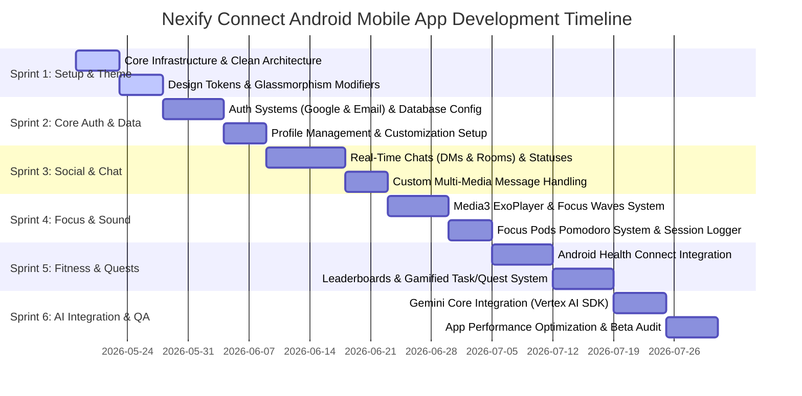

# Nexify Connect — Native Android (Kotlin + Firebase) Architectural Blueprint & Implementation Plan 🚀

This document serves as the master engineering blueprint and feature implementation plan for porting the premium, cyberpunk-aesthetic **Nexify Connect** ecosystem to a native mobile experience on Android, powered by **Kotlin** and **Firebase**. 

It is mathematically and structurally aligned with the existing Firestore schemas, UI/UX structure, and game mechanics of the Nexify Connect Web/Desktop application currently inside this workspace.

---

## 🗺️ System Topology & Platform Synergy

To deliver a premium, lag-free user experience, the mobile application mirrors the core modules of the Web/Vite ecosystem while utilizing native Android subsystems (such as hardware-accelerated Canvas, Android Health Connect, and background media services).

```mermaid
graph TD
    %% User Interfaces %%
    subgraph Native Android Application (Kotlin + Jetpack Compose)
        UI[UI Layer: Jetpack Compose]
        VM[ViewModel Layer: StateFlow & LiveData]
        UC[Domain UseCases: Clean Architecture]
        Repo[Data Repositories]
    end

    %% Web Platform %%
    subgraph Web App (React + Vite + CSS)
        WebUI[React UI]
        WebService[JS Services]
    end

    %% Unified Cloud Infrastructure %%
    subgraph Firebase Cloud Suite (Unified Platform Services)
        Auth[Firebase Auth]
        Firestore[(Cloud Firestore Database)]
        RTDB[(Realtime Database - Presence)]
        Storage[Firebase Storage / Cloudinary]
        FCM[Firebase Cloud Messaging]
    end

    %% Native Integrations %%
    subgraph Android OS Hardware
        HC[Health Connect API]
        Audio[Android Media3 / ExoPlayer]
        Haptic[Vibrator & HapticEngine]
    end

    %% Flow Connections %%
    UI --> VM
    VM --> UC
    UC --> Repo
    Repo --> Auth
    Repo --> Firestore
    Repo --> RTDB
    Repo --> Storage
    Repo --> FCM
    Repo --> HC
    Repo --> Audio
    Repo --> Haptic

    WebService --> Auth
    WebService --> Firestore
    WebService --> Storage
```

---

## 🎨 Cyber-Premium Design System (Jetpack Compose)

The mobile UI implements a customized Jetpack Compose theme featuring dynamic, hardware-accelerated **Glassmorphism**, neon shadow shaders, and high-refresh-rate micro-animations.

### 1. Cyberpunk Color Tokens
```kotlin
package com.nexify.connect.ui.theme

import androidx.compose.ui.graphics.Color

val DarkAMOLED = Color(0xFF000000)
val DarkGreyBG = Color(0xFF0A0F1F)
val GlassBgColor = Color(0x15FFFFFF)
val GlassBorderColor = Color(0x25FFFFFF)

// Accent Glow Colors
val CyberTeal = Color(0xFF00DFD8)
val NeonPurple = Color(0xFF7928CA)
val LaserPink = Color(0xFFFF0080)
val MatrixGreen = Color(0xFF10B981)
val GoldXP = Color(0xFFF59E0B)
val AlertRed = Color(0xFFFF5555)
val TextMuted = Color(0x8AFFFFFF)
```

### 2. Glassmorphic Modifier
Applying glassmorphic visuals with customizable backdrop filter shaders, translucent vertical gradients, and neon shadow boundaries in Jetpack Compose:

```kotlin
package com.nexify.connect.ui.components

import androidx.compose.foundation.background
import androidx.compose.foundation.border
import androidx.compose.foundation.layout.padding
import androidx.compose.foundation.shape.RoundedCornerShape
import androidx.compose.runtime.Composable
import androidx.compose.ui.Modifier
import androidx.compose.ui.draw.clip
import androidx.compose.ui.draw.shadow
import androidx.compose.ui.graphics.Brush
import androidx.compose.ui.graphics.Color
import androidx.compose.ui.graphics.graphicsLayer
import androidx.compose.ui.unit.Dp
import androidx.compose.ui.unit.dp
import com.nexify.connect.ui.theme.GlassBgColor
import com.nexify.connect.ui.theme.GlassBorderColor

@Composable
fun Modifier.cyberGlass(
    borderRadius: Dp = 16.dp,
    borderWidth: Dp = 1.dp,
    borderColor: Color = GlassBorderColor,
    glowColor: Color? = null
): Modifier = this.then(
    Modifier
        .graphicsLayer {
            clip = true
            shape = RoundedCornerShape(borderRadius)
        }
        .background(
            Brush.verticalGradient(
                colors = listOf(
                    GlassBgColor,
                    Color(0x05FFFFFF)
                )
            )
        )
        .border(
            width = borderWidth,
            brush = Brush.verticalGradient(
                colors = listOf(
                    borderColor,
                    borderColor.copy(alpha = 0.3f)
                )
            ),
            shape = RoundedCornerShape(borderRadius)
        )
        .run {
            if (glowColor != null) {
                this.shadow(
                    elevation = 12.dp,
                    shape = RoundedCornerShape(borderRadius),
                    ambientColor = glowColor,
                    spotColor = glowColor,
                    clip = false
                )
            } else this
        }
)
```

---

## 🗄️ Unified Firestore Schema & Native Models

To maintain 100% interoperability with the existing React web client, the Kotlin Android models map identically to the Firestore collections established in `src/services/`.

### 1. User & Profile Customizations (`/users/{uid}`)
```kotlin
package com.nexify.connect.data.models

import com.google.firebase.Timestamp
import com.google.firebase.firestore.DocumentId

data class User(
    @DocumentId val uid: String = "",
    val displayName: String = "",
    val username: String = "",
    val role: String = "user", // user, moderator, admin, ai
    val verified: Boolean = false,
    val bio: String = "",
    val photoURL: String = "",
    val bannerURL: String? = null,
    val presence: String = "offline", // online, idle, dnd, offline
    val createdAt: Timestamp? = null,
    val updatedAt: Timestamp? = null,
    val lastUsernameUpdate: Timestamp? = null,
    val lastNameUpdate: Timestamp? = null,
    val xp: Long = 0,
    val roleColor: String = "#00dfd8",
    val anthem: AnthemData? = null,
    val prefs: UserPrefs = UserPrefs()
)

data class AnthemData(
    val songId: String = "",
    val title: String = "",
    val artist: String = "",
    val trackUrl: String = ""
)

data class UserPrefs(
    val avatarRing: Boolean = true,
    val animatedStatus: Boolean = true,
    val customTheme: String = "cyber-blue", // cyber-blue, neon-purple, matrix
    val notificationsEnabled: Boolean = true
)
```

### 2. Real-Time Chat Message Structure (`/chats/{chatId}/messages/{messageId}`)
```kotlin
package com.nexify.connect.data.models

import com.google.firebase.Timestamp
import com.google.firebase.firestore.DocumentId

data class ChatMessage(
    @DocumentId val id: String = "",
    val senderId: String = "",
    val text: String = "",
    val type: String = "text", // text, image, video, voice, file, gif
    val mediaURL: String? = null,
    val fileName: String? = null,
    val fileSize: Long? = null,
    val createdAt: Timestamp? = null,
    val readBy: List<String> = emptyList(),
    val deleted: Boolean = false,
    val replyTo: ReplyReference? = null,
    val reactions: Map<String, String> = emptyMap() // uid -> emoji
)

data class ReplyReference(
    val id: String = "",
    val text: String = "",
    val senderId: String = ""
)
```

### 3. Gamified Tasks (`/users/{uid}/tasks/{taskId}`)
```kotlin
package com.nexify.connect.data.models

import com.google.firebase.Timestamp
import com.google.firebase.firestore.DocumentId

data class GamifiedTask(
    @DocumentId val id: String = "",
    val title: String = "",
    val type: String = "daily", // daily, focus, fitness, social
    val completed: Boolean = false,
    val xpReward: Long = 50,
    val deadline: Timestamp? = null,
    val icon: String = "📅",
    val progress: Int = 0, // 0 to 100
    val createdAt: Timestamp? = null
)
```

---

## 💎 Jetpack Compose Custom Premium Components

### 1. Animated Profile Borders (`PremiumAvatar.kt`)
Replicating the glowing, sweep-gradient animated avatar rings in Jetpack Compose:

```kotlin
package com.nexify.connect.ui.components

import androidx.compose.animation.core.*
import androidx.compose.foundation.Canvas
import androidx.compose.foundation.border
import androidx.compose.foundation.layout.*
import androidx.compose.foundation.shape.CircleShape
import androidx.compose.runtime.*
import androidx.compose.ui.Alignment
import androidx.compose.ui.Modifier
import androidx.compose.ui.draw.clip
import androidx.compose.ui.graphics.Brush
import androidx.compose.ui.graphics.Color
import androidx.compose.ui.graphics.drawscope.Stroke
import androidx.compose.ui.graphics.graphicsLayer
import androidx.compose.ui.layout.ContentScale
import androidx.compose.ui.platform.LocalContext
import androidx.compose.ui.unit.Dp
import androidx.compose.ui.unit.dp
import coil.compose.AsyncImage
import coil.request.ImageRequest
import com.nexify.connect.ui.theme.CyberTeal
import com.nexify.connect.ui.theme.LaserPink
import com.nexify.connect.ui.theme.NeonPurple

@Composable
fun PremiumAvatar(
    imageUrl: String,
    hasRing: Boolean = true,
    size: Dp = 64.dp,
    modifier: Modifier = Modifier
) {
    val infiniteTransition = rememberInfiniteTransition(label = "avatarGlowRing")
    val rotationAngle by infiniteTransition.animateFloat(
        initialValue = 0f,
        targetValue = 360f,
        animationSpec = infiniteRepeatable(
            animation = tween(durationMillis = 3500, easing = LinearEasing),
            repeatMode = RepeatMode.Restart
        ),
        label = "rotationAngle"
    )

    Box(
        modifier = modifier.size(size),
        contentAlignment = Alignment.Center
    ) {
        if (hasRing) {
            Canvas(modifier = Modifier.fillMaxSize().graphicsLayer { rotationZ = rotationAngle }) {
                drawCircle(
                    brush = Brush.sweepGradient(
                        colors = listOf(
                            CyberTeal,
                            NeonPurple,
                            LaserPink,
                            CyberTeal
                        )
                    ),
                    style = Stroke(width = 3.dp.toPx())
                )
            }
        }
        AsyncImage(
            model = ImageRequest.Builder(LocalContext.current)
                .data(imageUrl)
                .crossfade(true)
                .build(),
            contentDescription = "User Avatar",
            modifier = Modifier
                .fillMaxSize()
                .padding(if (hasRing) 6.dp else 0.dp)
                .clip(CircleShape)
                .border(1.dp, Color.Black, CircleShape),
            contentScale = ContentScale.Crop
        )
    }
}
```

### 2. Glowing Username Render (`GlowUsername.kt`)
Native Canvas drop-shadow shader overlay for elite premium badges:

```kotlin
package com.nexify.connect.ui.components

import android.graphics.BlurMaskFilter
import androidx.compose.foundation.layout.padding
import androidx.compose.material3.Text
import androidx.compose.runtime.Composable
import androidx.compose.ui.Modifier
import androidx.compose.ui.draw.drawBehind
import androidx.compose.ui.graphics.Color
import androidx.compose.ui.graphics.Paint
import androidx.compose.ui.graphics.drawscope.drawIntoCanvas
import androidx.compose.ui.graphics.nativeCanvas
import androidx.compose.ui.graphics.toArgb
import androidx.compose.ui.text.font.FontWeight
import androidx.compose.ui.unit.TextUnit
import androidx.compose.ui.unit.dp

@Composable
fun GlowUsername(
    text: String,
    fontSize: TextUnit,
    glowColor: Color,
    modifier: Modifier = Modifier
) {
    Text(
        text = text,
        fontSize = fontSize,
        fontWeight = FontWeight.Bold,
        color = Color.White,
        modifier = modifier
            .padding(horizontal = 4.dp)
            .drawBehind {
                drawIntoCanvas { canvas ->
                    val paint = Paint().asFrameworkPaint().apply {
                        isAntiAlias = true
                        this.color = glowColor.toArgb()
                        maskFilter = BlurMaskFilter(15f, BlurMaskFilter.Blur.OUTER)
                    }
                    canvas.nativeCanvas.drawText(
                        text,
                        0f,
                        size.height - 4.dp.toPx(),
                        paint
                    )
                }
            }
    )
}
```

### 3. Instagram-Style Double Tap animator (`DoubleTapLike.kt`)
```kotlin
package com.nexify.connect.ui.components

import androidx.compose.animation.core.Animatable
import androidx.compose.animation.core.Spring
import androidx.compose.animation.core.spring
import androidx.compose.animation.core.tween
import androidx.compose.foundation.gestures.detectTapGestures
import androidx.compose.foundation.layout.Box
import androidx.compose.foundation.layout.BoxScope
import androidx.compose.foundation.layout.fillMaxSize
import androidx.compose.foundation.layout.size
import androidx.compose.material.icons.Icons
import androidx.compose.material.icons.filled.Favorite
import androidx.compose.material3.Icon
import androidx.compose.runtime.*
import androidx.compose.ui.Alignment
import androidx.compose.ui.Modifier
import androidx.compose.ui.draw.scale
import androidx.compose.ui.graphics.Color
import androidx.compose.ui.graphics.graphicsLayer
import androidx.compose.ui.input.pointer.pointerInput
import androidx.compose.ui.unit.dp
import com.nexify.connect.ui.theme.LaserPink
import kotlinx.coroutines.launch

@Composable
fun DoubleTapLikeGesture(
    onDoubleTap: () -> Unit,
    modifier: Modifier = Modifier,
    content: @Composable BoxScope.() -> Unit
) {
    val coroutineScope = rememberCoroutineScope()
    val scaleAnim = remember { Animatable(0f) }
    var isHeartVisible by remember { mutableStateOf(false) }

    Box(
        modifier = modifier.pointerInput(Unit) {
            detectTapGestures(
                onDoubleTap = {
                    onDoubleTap()
                    isHeartVisible = true
                    coroutineScope.launch {
                        scaleAnim.snapTo(0f)
                        scaleAnim.animateTo(
                            targetValue = 1.3f,
                            animationSpec = spring(
                                dampingRatio = Spring.DampingRatioMediumBouncy,
                                stiffness = Spring.StiffnessLow
                            )
                        )
                        scaleAnim.animateTo(0f, animationSpec = tween(durationMillis = 200))
                        isHeartVisible = false
                    }
                }
            )
        }
    ) {
        content()
        if (isHeartVisible) {
            Icon(
                imageVector = Icons.Filled.Favorite,
                contentDescription = "Double Tap Like Glow",
                tint = LaserPink,
                modifier = Modifier
                    .size(90.dp)
                    .align(Alignment.Center)
                    .scale(scaleAnim.value)
                    .graphicsLayer { alpha = if (scaleAnim.value > 1f) 1f else scaleAnim.value }
            )
        }
    }
}
```

---

## 📱 Mobile Screen-by-Screen Navigation Architecture

The app uses `Jetpack Compose Navigation` powered by Kotlin DSL, wrapping all screens into a premium global `AppShell` with bottom navigation and real-time call portals.

### Navigation Route Layout
```kotlin
package com.nexify.connect.ui.navigation

sealed class Screen(val route: String) {
    object Splash : Screen("splash")
    object Login : Screen("login")
    object Signup : Screen("signup")
    object Home : Screen("home")
    object Chats : Screen("chats")
    object ChatConversation : Screen("chat/{chatId}") {
        fun createRoute(chatId: String) = "chat/$chatId"
    }
    object Rooms : Screen("rooms")
    object RoomChat : Screen("room/{roomId}") {
        fun createRoute(roomId: String) = "room/$roomId"
    }
    object CreateRoom : Screen("create_room")
    object FocusPods : Screen("focus_pods")
    object NexifyWaves : Screen("nexify_waves")
    object NexifyFit : Screen("nexify_fit")
    object NexifyEdge : Screen("nexify_edge")
    object NexifyAI : Screen("nexify_ai")
    object Leaderboards : Screen("leaderboards")
    object Tasks : Screen("tasks")
    object Profile : Screen("profile")
    object ProfileCustomization : Screen("profile_customization")
    object Friends : Screen("friends")
    object Notifications : Screen("notifications")
    object Settings : Screen("settings")
    object SettingsDetail : Screen("settings/{settingType}") {
        fun createRoute(type: String) = "settings/$type"
    }
}
```

### 🖥️ Deep-Dive Screen Blueprints (All 20+ Screens)

#### 1. Splash & Onboarding (`Splash.kt`)
*   **Visual Structure**: Centered glowing holographic orb logo with custom drop shadows. Horizontal bounce animation loading points. Vertical background particles.
*   **Logic**: Performs active check on `FirebaseAuth.getInstance().currentUser`. Pre-fetches system variables from Firestore (`/config/system`).
*   **Transition**: Launches slide-up animation fading into `/login` or `/home`.

#### 2. Identity Entry - Login (`Login.kt`)
*   **Visual Structure**: AMOLED dark cards with subtle neon glow borders. Glassmorphic text input boxes.
*   **Logic**: Authenticates via Firebase Auth (Email/Password). Triggers Google Sign-in flow using Google Identity API Credential Manager.
*   **Features**: Includes real-time validation, dynamic error toast triggers, and robust "Forgot Password" triggers.

#### 3. Identity Registration - Signup (`Signup.kt`)
*   **Visual Structure**: Step-by-step registration flow. Form validation indicators.
*   **Logic**: Firebase Email registration. Post-creation user record seeding inside Firestore (`/users/{uid}`).
*   **Transition**: Transitions immediately to Profile Setup.

#### 4. Setup Portal - Initial Profile Customization (`SetupProfile.kt`)
*   **Visual Structure**: Transparent card with immediate live preview of avatar rings and banners. Custom sliders.
*   **Logic**: Seeds public user metadata into Firestore database. Uploads high-res media direct to Cloud Storage.

#### 5. Feed Hub - Home Feed (`HomeFeed.kt`)
*   **Visual Structure**: Dual-tab feed layout ("Global Posts" & "Friends Feed"). Clean list interface resembling premium Instagram layouts. Glassmorphic top headers.
*   **Logic**: LazyColumn rendering dynamic custom posts fetched in real-time from Firestore (`/posts`).
*   **Features**: Double tap gesture to like. Bottom drawer comments panel. Haptic clicks on like buttons.

#### 6. Dynamic Chat Hub (`ChatsList.kt`)
*   **Visual Structure**: Vertical scrolling feed displaying active chats. Translucent cards representing chat rows. Live glowing online/offline status lights.
*   **Logic**: Real-time snapshots mapping (`/chats`) collection using direct `memberMap.{uid} == true` filters. Displays live unread tallies and short previews.

#### 7. Direct Thread Workspace (`DirectChat.kt`)
*   **Visual Structure**: Custom chat layout. Message clouds with specific neon color accents (Sender gets Purple, Receiver gets Dark Grey). Bottom sliding attachment dock.
*   **Logic**: Direct Firestore listeners tracking (`/chats/{chatId}/messages`). Integrated typing indicator using Firebase RTDB presence listeners.
*   **Features**: Swipe to reply. Long-press emoji reactions. Real-time typing indicators. Seen / Delivered statuses.

#### 8. Spatial Audio and Room Hub (`RoomsList.kt`)
*   **Visual Structure**: Discord-style structured channel hierarchy. Grid of voice, text, and media channels. Glassmorphic room cards.
*   **Logic**: Unified room index streams (`/rooms`). Displays active, live listener counters and real-time room sizes.

#### 9. Room Communication Platform (`RoomChat.kt`)
*   **Visual Structure**: Split screen layout: Top 30% shows active voice members with glowing avatars; Bottom 70% shows real-time threaded chat. Right-sliding channel admin side-panel.
*   **Logic**: Dynamic Firestore channel tracking combined with room member removal permissions (Discord-style admin panel).

#### 10. Voice Creator - Setup Room (`CreateRoom.kt`)
*   **Visual Structure**: Custom modal sheet listing room parameters. Selectable color/accent schemes for the room chat visual interface.
*   **Logic**: Generates room documents inside Firestore (`/rooms`) complete with permissions, default welcome channels, and moderators.

#### 11. Focus Waves Engine (`FocusWaves.kt`)
*   **Visual Structure**: High-contrast, dark mode interface. Immersive glass cards displaying available environments (Rain, Cyber Cafe, Night City, Neural Sync). Interactive, glowing pulse visualizer showing active sound wave levels.
*   **Logic**: Integrates Media3 ExoPlayer background playback engine. Loads local/remote assets in loops.
*   **Features**: Independent volume sliders for ambient sounds and background focus pod music. Real-time timer triggers.

#### 12. Focus Pod Dashboard (`FocusPods.kt`)
*   **Visual Structure**: Large circular countdown timer that pulsates and glows depending on active states. Glass progress curves.
*   **Logic**: Manages Pomodoro focus cycles. Adds focus logs directly to Firestore (`/users/{uid}/focus_sessions`) upon timer completion.
*   **Features**: XP rewards on focus cycle completion. Dynamic haptic pulses.

#### 13. Health Terminal - Nexify Fit (`NexifyFit.kt`)
*   **Visual Structure**: Glowing activity rings. Animated step goals. Hydration trackers. Workout schedule grids.
*   **Logic**: Local background sync via **Android Health Connect SDK**. Maps user steps, active calories, and sleep statistics directly to Firestore metrics.
*   **Features**: Smart workout suggestions based on steps and hydration goals.

#### 14. Information Node - Nexify Edge (`NexifyEdge.kt`)
*   **Visual Structure**: Split card vertical grid. Cyberpunk-themed tech news feed with bright custom highlight banners.
*   **Logic**: Fetches processed feeds containing tech topics and news. Integrates localized bookmarking.

#### 15. Synthetic Agent Core - Nexify AI (`NexifyAI.kt`)
*   **Visual Structure**: Futuristic AI dialog dashboard. Holographic typing animations. Smart reply option pill containers.
*   **Logic**: Direct integration with Gemini API (Vertex AI SDK for Firebase). Feeds full context streams to provide answers, summarize chat threads, or suggest bio tags.

#### 16. Search Grid - Global Search (`GlobalSearch.kt`)
*   **Visual Structure**: Glass search fields. Filter pills (All, Users, Rooms, Posts).
*   **Logic**: Fast debounced query processing across users, rooms, and posts using Firestore indexing queries.

#### 17. The Arena - Leaderboards (`Leaderboards.kt`)
*   **Visual Structure**: Podium visual layout for top 3 elite users. Tiered ranking tables (Founder, Nexus Legend, Elite Developer, etc.). Glowing border ranks.
*   **Logic**: Firestore queries listening to `/users` sorted by `xp` descending, matching exact level parameters.

#### 18. Quest Log - Tasks & Objectives (`Tasks.kt`)
*   **Visual Structure**: Category horizontal lists (Daily, Focus, Fitness, Social). Custom progress meters.
*   **Logic**: Real-time Firestore synchronization of user tasks. Awards XP on tap and displays immediate holographic feedback.

#### 19. Identity Card - User Profile (`UserProfile.kt`)
*   **Visual Structure**: Large glass cards showing custom profile banner art, animated avatars, verification marks, active profile anthem song trackers, and XP stats.
*   **Logic**: Gathers post metrics, friend counts, and active badges. Triggers real-time status selector panel.

#### 20. Identity Customization (`Customization.kt`)
*   **Visual Structure**: Color palettes, customizable glow rings, badge visual lists, and custom bio inputs.
*   **Logic**: Uploads data to Cloud Storage. Checks cooldown restrictions before updating usernames.

#### 21. Real-Time Calls Interface (`ActiveCall.kt`)
*   **Visual Structure**: Premium calling interface. Holographic participant displays. Call quality graphs. Mute/Camera toggle cards.
*   **Logic**: Custom WebRTC signaling backed by Firebase Firestore listeners. Integrates in-call haptics.

#### 22. Notification Center (`Notifications.kt`)
*   **Visual Structure**: Categorized vertical list displaying alerts, likes, friend requests, and mentions. Swipe-to-dismiss items.
*   **Logic**: Dynamic Firestore notification snapshots. Direct deep-linking support on tap.

#### 23. Settings Configuration Panel (`Settings.kt`)
*   **Visual Structure**: Categorized scroll layout (Account, Custom Themes, Notifications, Privacy, Admin Panel). Glassmorphic dividers.
*   **Logic**: Saves local app properties and triggers profile setting changes.

#### 24. Theme and Aesthetics Studio (`Appearance.kt`)
*   **Visual Structure**: High-resolution active themes cards showing live preview boxes. Custom color selection wheels.
*   **Logic**: Globally modifies application ThemeState using Compose state engines.

---

## 🛠️ Infrastructure & Native Systems Integration

### 1. Real-Time Presence System (Firestore + RTDB)
To manage active status indicators ("online", "idle", "dnd", "offline") instantly, the Android client uses a hybrid Firestore and Realtime Database structure via Firebase Presence APIs.

```kotlin
package com.nexify.connect.services

import com.google.firebase.auth.FirebaseAuth
import com.google.firebase.database.FirebaseDatabase
import com.google.firebase.firestore.FirebaseFirestore
import java.util.HashMap

object PresenceTracker {
    private val rtdb = FirebaseDatabase.getInstance()
    private val firestore = FirebaseFirestore.getInstance()
    private val auth = FirebaseAuth.getInstance()

    fun initialize() {
        val uid = auth.currentUser?.uid ?: return
        val userStatusDatabaseRef = rtdb.getReference("/status/$uid")
        val userStatusFirestoreRef = firestore.collection("users").document(uid)

        val isOfflineForDatabase = HashMap<String, Any>()
        isOfflineForDatabase["presence"] = "offline"
        isOfflineForDatabase["lastChanged"] = com.google.firebase.database.ServerValue.TIMESTAMP

        val isOnlineForDatabase = HashMap<String, Any>()
        isOnlineForDatabase["presence"] = "online"
        isOnlineForDatabase["lastChanged"] = com.google.firebase.database.ServerValue.TIMESTAMP

        rtdb.getReference(".info/connected").addValueEventListener(object : com.google.firebase.database.ValueEventListener {
            override fun onDataChange(snapshot: com.google.firebase.database.DataSnapshot) {
                val connected = snapshot.getValue(Boolean::class.java) ?: false
                if (connected) {
                    userStatusDatabaseRef.onDisconnect().setValue(isOfflineForDatabase).addOnCompleteListener {
                        userStatusDatabaseRef.setValue(isOnlineForDatabase)
                        userStatusFirestoreRef.update("presence", "online")
                    }
                }
            }
            override fun onCancelled(error: com.google.firebase.database.DatabaseError) {}
        })
    }
}
```

### 2. Physical Data Integration (Android Health Connect)
Integrates step count sensors directly into the Nexify XP system, letting users track fitness and level up simultaneously.

```kotlin
package com.nexify.connect.services

import android.content.Context
import androidx.health.connect.client.HealthConnectClient
import androidx.health.connect.client.request.ReadRecordsRequest
import androidx.health.connect.client.time.TimeRangeFilter
import androidx.health.connect.client.records.StepsRecord
import java.time.Instant
import java.time.temporal.ChronoUnit

class FitnessTracker(private val context: Context) {
    private val healthConnectClient by lazy {
        if (HealthConnectClient.isSdkSupported()) HealthConnectClient.getOrCreate(context) else null
    }

    suspend fun getStepsForToday(): Long {
        val client = healthConnectClient ?: return 0L
        val startTime = Instant.now().truncatedTo(ChronoUnit.DAYS)
        val endTime = Instant.now()
        
        return try {
            val response = client.readRecords(
                ReadRecordsRequest(
                    recordType = StepsRecord::class,
                    timeRangeFilter = TimeRangeFilter.between(startTime, endTime)
                )
            )
            response.records.sumOf { it.count }
        } catch (e: Exception) {
            0L
        }
    }
}
```

### 3. Background Ambient Audio Engine (Media3 ExoPlayer)
Ensures seamless, low-latency playback for Nexify Waves/Focus Pods, even when the app is in the background.

```kotlin
package com.nexify.connect.services

import android.content.Context
import androidx.media3.common.MediaItem
import androidx.media3.common.Player
import androidx.media3.exoplayer.ExoPlayer

class WaveAudioPlayer(private val context: Context) {
    private var exoPlayer: ExoPlayer? = null

    fun initializePlayer() {
        if (exoPlayer == null) {
            exoPlayer = ExoPlayer.Builder(context).build().apply {
                repeatMode = Player.REPEAT_MODE_ALL
                playWhenReady = false
            }
        }
    }

    fun playAmbientSound(audioUrl: String) {
        val player = exoPlayer ?: return
        val mediaItem = MediaItem.fromUri(audioUrl)
        player.setMediaItem(mediaItem)
        player.prepare()
        player.play()
    }

    fun setVolume(volume: Float) {
        exoPlayer?.volume = volume.coerceIn(0f, 1f)
    }

    fun release() {
        exoPlayer?.release()
        exoPlayer = null
    }
}
```

---

## 🚀 6-Sprint Phased Feature Implementation Plan



### Sprint 1: Setup & Theme (Days 1–10)
*   **Deliverables**: Clean Architecture folder structures (`/data`, `/domain`, `/ui`), Dependency Injection configurations (Hilt), and standard theme color definitions.
*   **Design Focus**: Build shared UI components: `Modifier.cyberGlass()`, dynamic cyberpunk buttons, and base screen containers.
*   **Testing Benchmark**: Run baseline layout performance tests on mid-range devices to verify glassmorphism rendering speeds maintain 60-120fps.

### Sprint 2: Core Auth & Data (Days 11–22)
*   **Deliverables**: Firebase Authentication integrations (Email + Google sign-in workflows), database adapters, and user onboarding steps.
*   **Design Focus**: Build custom avatar selection sheets with dynamic border preview rings.
*   **Testing Benchmark**: Mock slow network conditions to ensure robust signup errors and elegant loading indicators.

### Sprint 3: Social & Chat (Days 23–36)
*   **Deliverables**: Real-time messaging engines, direct messaging screens, room voice chat grids, and profile presence states.
*   **Design Focus**: Premium chat message layouts featuring custom reply previews and long-press animated reaction panels.
*   **Testing Benchmark**: Simulate concurrent chat loads with up to 100 users typing and exchanging media to ensure seamless scaling.

### Sprint 4: Focus & Sound (Days 37–48)
*   **Deliverables**: Media3 background sound engines, active sound visualizers, and Pomodoro timers.
*   **Design Focus**: Immersive custom canvas visualizers showing real-time ambient noise levels.
*   **Testing Benchmark**: Verify steady background playback during resource-heavy multi-tasking.

### Sprint 5: Fitness & Quests (Days 49–62)
*   **Deliverables**: Health Connect sync bridges, Arena leaderboards, and interactive daily quest logs.
*   **Design Focus**: Dynamic step counters and animated custom rank badges.
*   **Testing Benchmark**: Perform local step updates to verify automatic Firestore XP synchronization.

### Sprint 6: AI Integration & QA (Days 63–74)
*   **Deliverables**: Gemini integrations (via Vertex AI SDK) for smart replies and automated bios. Core system auditing and performance testing.
*   **Design Focus**: Interactive AI chatbot dialog sheets featuring dynamic holographic text rendering.
*   **Testing Benchmark**: Zero memory leaks during heavy tab switching, rapid chat sessions, or focus loops.

---

## ⚡ Key Optimizations & Offline-First Design

### 1. Offline Firestore Caching & Queues
To ensure a smooth, lag-free user experience, Firestore offline persistence is enabled globally on mobile. Chat messages sent while offline are added to local pending queues and seamlessly synchronized once connection is restored.
```kotlin
val settings = FirebaseFirestoreSettings.Builder()
    .setPersistenceEnabled(true)
    .setCacheSizeBytes(FirebaseFirestoreSettings.CACHE_SIZE_UNLIMITED)
    .build()
FirebaseFirestore.getInstance().firestoreSettings = settings
```

### 2. Media Optimization & Compression Hook
Images and attachments are scaled, converted to high-efficiency WebP formats, and queued for upload via Android WorkManager to prevent main thread blocking and high data usage.

### 3. Dynamic Frame-Rate Management
Disable real-time Canvas glow and rotating sweep animations on devices running in Power Saving Mode or with low hardware capabilities to preserve system battery.

```kotlin
@Composable
fun isAnimationEnabled(): Boolean {
    val context = LocalContext.current
    val powerManager = context.getSystemService(Context.POWER_SERVICE) as PowerManager
    return !powerManager.isPowerSaveMode
}
```
